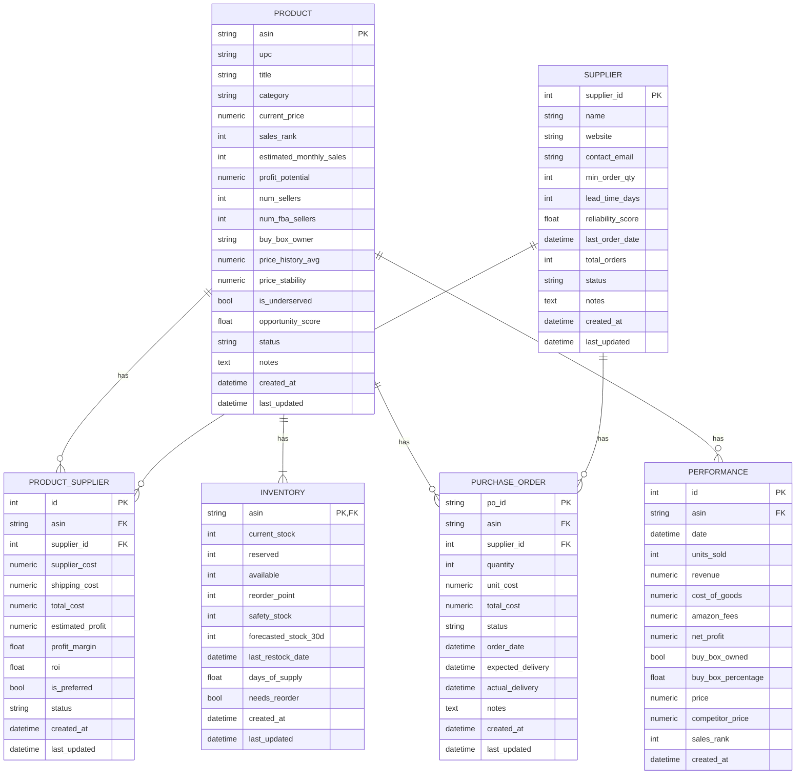

# Amazon Replens Automation System - Database Schema

This document outlines the database schema for the Amazon Replens Automation System. The schema is designed to be relational, scalable, and efficient for querying and data analysis. It is implemented using SQLAlchemy ORM.

## Schema Diagram

## Table Definitions

### 1. `products`

Stores information about each Amazon product (ASIN) being tracked.

| Column | Type | Description |
|---|---|---|
| `asin` | `String(10)` | **Primary Key**. Amazon Standard Identification Number. |
| `upc` | `String(14)` | Universal Product Code. |
| `title` | `String(500)` | Product title. |
| `category` | `String(200)` | Amazon product category. |
| `current_price` | `Numeric(10, 2)` | Current selling price on Amazon. |
| `sales_rank` | `Integer` | Current sales rank. |
| `estimated_monthly_sales` | `Integer` | Estimated monthly sales velocity. |
| `profit_potential` | `Numeric(10, 2)` | Estimated profit per unit. |
| `num_sellers` | `Integer` | Number of active sellers. |
| `num_fba_sellers` | `Integer` | Number of FBA sellers. |
| `buy_box_owner` | `String(200)` | Name of the current Buy Box owner. |
| `price_history_avg` | `Numeric(10, 2)` | Average price over the last 90 days. |
| `price_stability` | `Numeric(10, 2)` | Standard deviation of the price. |
| `is_underserved` | `Boolean` | Flag indicating if the product is an underserved opportunity. |
| `opportunity_score` | `Float` | A score from 0-100 representing the quality of the opportunity. |
| `status` | `String(20)` | `active`, `archived`, `rejected`. |
| `notes` | `Text` | Manual notes and observations. |
| `created_at` | `DateTime` | Timestamp of when the product was added. |
| `last_updated` | `DateTime` | Timestamp of the last update. |

**Indexes:** `asin`, `upc`, `status`, `is_underserved`, `opportunity_score`

### 2. `suppliers`

Stores information about each supplier or vendor.

| Column | Type | Description |
|---|---|---|
| `supplier_id` | `Integer` | **Primary Key**. Unique identifier for the supplier. |
| `name` | `String(200)` | Supplier name. |
| `website` | `String(500)` | Supplier's website URL. |
| `contact_email` | `String(200)` | Contact email for the supplier. |
| `min_order_qty` | `Integer` | Minimum order quantity. |
| `lead_time_days` | `Integer` | Typical lead time in days for delivery. |
| `reliability_score` | `Float` | A score from 0-100 based on historical performance. |
| `last_order_date` | `DateTime` | Timestamp of the last order placed with this supplier. |
| `total_orders` | `Integer` | Lifetime number of orders placed. |
| `status` | `String(20)` | `active`, `inactive`, `blacklisted`. |
| `notes` | `Text` | Manual notes about the supplier. |
| `created_at` | `DateTime` | Timestamp of when the supplier was added. |
| `last_updated` | `DateTime` | Timestamp of the last update. |

**Indexes:** `supplier_id`, `name`

### 3. `product_suppliers`

A junction table linking products to suppliers, including cost information.

| Column | Type | Description |
|---|---|---|
| `id` | `Integer` | **Primary Key**. Unique identifier for the link. |
| `asin` | `String(10)` | **Foreign Key** to `products.asin`. |
| `supplier_id` | `Integer` | **Foreign Key** to `suppliers.supplier_id`. |
| `supplier_cost` | `Numeric(10, 2)` | Cost per unit from the supplier. |
| `shipping_cost` | `Numeric(10, 2)` | Shipping cost per unit. |
| `total_cost` | `Numeric(10, 2)` | Total landed cost per unit (`supplier_cost` + `shipping_cost`). |
| `estimated_profit` | `Numeric(10, 2)` | Estimated profit per unit. |
| `profit_margin` | `Float` | Profit margin as a percentage (e.g., 0.25 for 25%). |
| `roi` | `Float` | Return on Investment. |
| `is_preferred` | `Boolean` | Flag indicating if this is the preferred supplier for this product. |
| `status` | `String(20)` | `active`, `inactive`. |
| `created_at` | `DateTime` | Timestamp of when the link was created. |
| `last_updated` | `DateTime` | Timestamp of the last update. |

**Indexes:** `asin`, `supplier_id`

### 4. `inventory`

Tracks current and forecasted inventory levels for each product.

| Column | Type | Description |
|---|---|---|
| `asin` | `String(10)` | **Primary Key, Foreign Key** to `products.asin`. |
| `current_stock` | `Integer` | Units currently in Amazon FBA. |
| `reserved` | `Integer` | Units reserved for pending orders. |
| `available` | `Integer` | Units available for sale (`current_stock` - `reserved`). |
| `reorder_point` | `Integer` | Inventory level that triggers a reorder. |
| `safety_stock` | `Integer` | Minimum buffer stock to hold. |
| `forecasted_stock_30d` | `Integer` | Predicted stock level in 30 days. |
| `last_restock_date` | `DateTime` | Timestamp of the last inventory restock. |
| `days_of_supply` | `Float` | Estimated days until stockout at the current sales velocity. |
| `needs_reorder` | `Boolean` | Flag indicating if the product needs to be reordered. |
| `created_at` | `DateTime` | Timestamp of when the record was created. |
| `last_updated` | `DateTime` | Timestamp of the last update. |

**Indexes:** `asin`, `needs_reorder`

### 5. `purchase_orders`

Tracks purchase orders for inventory replenishment.

| Column | Type | Description |
|---|---|---|
| `po_id` | `String(50)` | **Primary Key**. Unique purchase order identifier. |
| `asin` | `String(10)` | **Foreign Key** to `products.asin`. |
| `supplier_id` | `Integer` | **Foreign Key** to `suppliers.supplier_id`. |
| `quantity` | `Integer` | Number of units ordered. |
| `unit_cost` | `Numeric(10, 2)` | Cost per unit for this order. |
| `total_cost` | `Numeric(10, 2)` | Total cost of the purchase order. |
| `status` | `String(20)` | `pending`, `confirmed`, `shipped`, `received`, `cancelled`. |
| `order_date` | `DateTime` | Timestamp of when the PO was created. |
| `expected_delivery` | `DateTime` | Expected delivery date. |
| `actual_delivery` | `DateTime` | Actual delivery date. |
| `notes` | `Text` | Notes or special instructions for the PO. |
| `created_at` | `DateTime` | Timestamp of when the record was created. |
| `last_updated` | `DateTime` | Timestamp of the last update. |

**Indexes:** `po_id`, `asin`, `supplier_id`, `status`

### 6. `performance`

Stores daily performance metrics for each product.

| Column | Type | Description |
|---|---|---|
| `id` | `Integer` | **Primary Key**. Unique identifier for the performance record. |
| `asin` | `String(10)` | **Foreign Key** to `products.asin`. |
| `date` | `DateTime` | The date for which the metrics are recorded. |
| `units_sold` | `Integer` | Number of units sold on this day. |
| `revenue` | `Numeric(10, 2)` | Total revenue for this day. |
| `cost_of_goods` | `Numeric(10, 2)` | Total cost of goods sold. |
| `amazon_fees` | `Numeric(10, 2)` | Total Amazon fees for this day. |
| `net_profit` | `Numeric(10, 2)` | Net profit for this day. |
| `buy_box_owned` | `Boolean` | Flag indicating if the Buy Box was owned at the end of the day. |
| `buy_box_percentage` | `Float` | Percentage of the day the Buy Box was owned. |
| `price` | `Numeric(10, 2)` | Price at the end of the day. |
| `competitor_price` | `Numeric(10, 2)` | Lowest competitor price at the end of the day. |
| `sales_rank` | `Integer` | Sales rank at the end of the day. |
| `created_at` | `DateTime` | Timestamp of when the record was created. |

**Indexes:** `id`, `asin`, `date`
