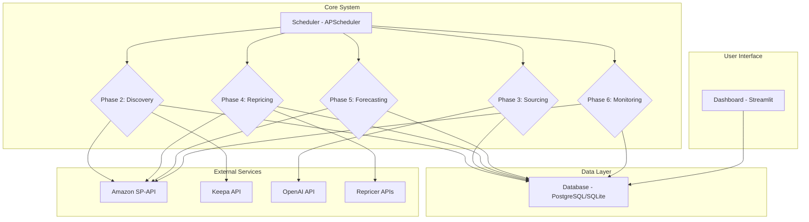

# Amazon Replens Automation System - System Architecture

This document provides a detailed overview of the system architecture for the Amazon Replens Automation System. The architecture is designed to be modular, scalable, and maintainable, leveraging a microservices-inspired approach for each core component.

## 1. High-Level Architecture

The system is composed of five core modules, a central database, and a set of API wrappers for interacting with external services. A scheduler orchestrates the execution of each module, and a dashboard provides a user interface for monitoring and manual intervention.

## 2. Component Breakdown

### 2.1. Scheduler (`scheduler.py`)

- **Technology:** `APScheduler`
- **Responsibility:** Orchestrates the execution of the different system modules based on a predefined schedule (configured in `.env`).
- **Jobs:**
    - **Product Discovery:** Runs daily (e.g., at 2 AM) to find new opportunities.
    - **Repricing:** Runs hourly to adjust prices.
    - **Inventory Check:** Runs daily to monitor stock levels.
    - **Demand Forecasting:** Runs daily to update sales forecasts.
    - **Dashboard Refresh:** Runs every 5 minutes to update dashboard data.

### 2.2. API Wrappers (`api_wrappers/`)

- **Responsibility:** Provide a clean, high-level interface to external APIs, handling authentication, rate limiting, and error handling.
- **`amazon_sp_api.py`:** Interacts with the Amazon Selling Partner API for product data, inventory, pricing, and orders.
- **`keepa_api.py`:** Interacts with the Keepa API for historical price and sales rank data.
- **`openai_api.py`:** (Optional) Interacts with the OpenAI API for NLP tasks like supplier matching and content generation.

### 2.3. Database (`database.py`)

- **Technology:** `SQLAlchemy` ORM with `PostgreSQL` (recommended for production) or `SQLite` (for development).
- **Responsibility:** Provides a persistent data store for all system data, including products, suppliers, inventory, purchase orders, and performance metrics.
- **Schema:** See `DATABASE_SCHEMA.md` for a detailed schema definition.

### 2.4. Core Modules (`phases/`)

Each core module is implemented as a separate Python script, allowing for independent execution and testing.

#### Phase 2: Product Discovery Engine (`phase_2_discovery.py`)

- **Responsibility:** Identifies high-potential replenishable products.
- **Workflow:**
    1. Queries the Keepa API for products in specified categories or based on search criteria.
    2. Filters products based on predefined thresholds (sales rank, price stability, number of sellers).
    3. Uses a machine learning model (`discovery_model.py`) to score and rank opportunities.
    4. Saves the top opportunities to the `products` table in the database.

#### Phase 3: Supplier Matching & Procurement (`phase_3_sourcing.py`)

- **Responsibility:** Finds reliable suppliers for identified products and automates the procurement process.
- **Workflow:**
    1. For each new opportunity, extracts the UPC/EAN from the product data.
    2. Uses the OpenAI API or other sourcing tools to find potential suppliers.
    3. Calculates the potential profitability for each supplier, taking into account all costs.
    4. Saves the best supplier options to the `product_suppliers` table.
    5. Generates purchase orders when inventory needs to be replenished.

#### Phase 4: Dynamic Repricing Engine (`phase_4_repricing.py`)

- **Responsibility:** Optimizes product prices to maximize profit and win the Amazon Buy Box.
- **Workflow:**
    1. Monitors competitor pricing using the SP-API and Keepa API.
    2. Integrates with a third-party repricing tool (e.g., Eva.guru) or uses a custom rules engine.
    3. Updates prices via the SP-API, ensuring they stay within predefined profitability bounds.

#### Phase 5: Inventory Forecasting & Replenishment (`phase_5_forecasting.py`)

- **Responsibility:** Predicts future demand and automates inventory replenishment.
- **Workflow:**
    1. Pulls historical sales data from the SP-API.
    2. Uses a machine learning model (`forecast_model.py`) to predict future demand.
    3. Calculates the reorder point and safety stock for each product.
    4. Triggers the generation of a purchase order when inventory levels fall below the reorder point.

### 2.5. Machine Learning Models (`models/`)

- **`discovery_model.py`:** A classification or ranking model (e.g., `RandomForestClassifier` or `XGBRanker`) trained on historical data of successful Replens products.
- **`forecast_model.py`:** A time-series forecasting model (e.g., `Prophet` or `XGBoost`) for predicting future sales.

### 2.6. Dashboard (`dashboard/app.py`)

- **Technology:** `Streamlit`
- **Responsibility:** Provides a web-based user interface for monitoring system performance and for manual intervention.
- **Features:**
    - **Overview KPIs:** Real-time view of revenue, profit, ROI, inventory turnover, and Buy Box win rate.
    - **Product Management:** View and manage the list of tracked products.
    - **Opportunity Review:** Review and approve new product opportunities.
    - **Inventory Status:** Monitor stock levels and reorder alerts.
    - **Performance Charts:** Visualize sales trends, profitability, and other key metrics.

## 3. Data Flow

1. The **Scheduler** triggers the **Product Discovery Engine**.
2. The **Product Discovery Engine** fetches data from the **Keepa API** and **Amazon SP-API**, processes it, and saves new opportunities to the **Database**.
3. The **Scheduler** triggers the **Supplier Matching Engine**.
4. The **Supplier Matching Engine** reads new opportunities from the **Database**, uses the **OpenAI API** to find suppliers, and saves the results back to the **Database**.
5. The **Scheduler** triggers the **Dynamic Repricing Engine**.
6. The **Dynamic Repricing Engine** reads product and competitor data from the **Database** and external APIs, calculates new prices, and updates them via the **Amazon SP-API**.
7. The **Scheduler** triggers the **Inventory Forecasting Engine**.
8. The **Inventory Forecasting Engine** reads sales history from the **Database**, forecasts future demand, and updates inventory parameters. If a reorder is needed, it creates a new purchase order in the **Database**.
9. The **Dashboard** continuously reads data from the **Database** to provide a real-time view of the system.

## 4. Deployment Architecture

- **Technology:** `Docker`, `docker-compose`
- **Recommended Setup:**
    - A `web` service for the Streamlit dashboard.
    - A `scheduler` service for running the scheduled jobs.
    - A `worker` service (using Celery) for running long-running tasks asynchronously.
    - A `db` service for the PostgreSQL database.
    - A `redis` service for the Celery message broker.

See `DEPLOYMENT.md` for a detailed deployment guide.
